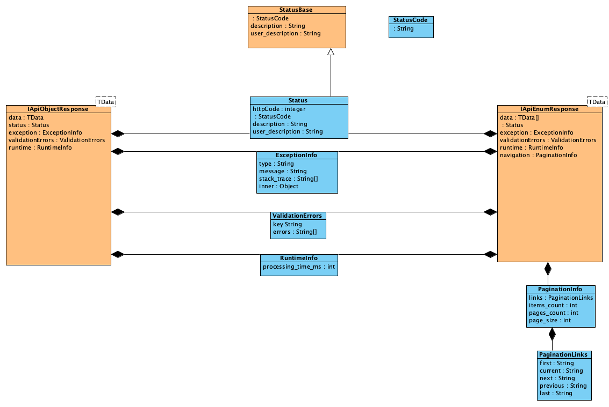

# NexusatAspNetCore REST API µ-Framework

# WORK IN PROGRESS…

Todo…

# Documentation

You can find the documentation [here](https://mrbogomips.github.io/NexusatAspNetCore).

## Response Model

Basically when you implement a RESTful API you can choose among three kind of response:

* **StatusBase**: basic response
* **IApiObjectResponse&lt;TData&gt;**: for API that returns a simple object conforming to *TData*
* **IApiEnumResponse&lt;TData&gt;**: for API that returns a paginated list of objects conforming to *TData*

## Dotnet CLI Integration

Use the solution `Nexusat.AspNetCode.Code.sln` to build and test via `dotnet` CLI interface.

## Contribution

The documentation is produced using [DocFX](https://dotnet.github.io/docfx/).
The project *docfx_project* is the source root.
In order to build the artificats is required `docfx` installed on your building environment.

### Mac Setup

Just run `brew install docfx` to setup your machine.
